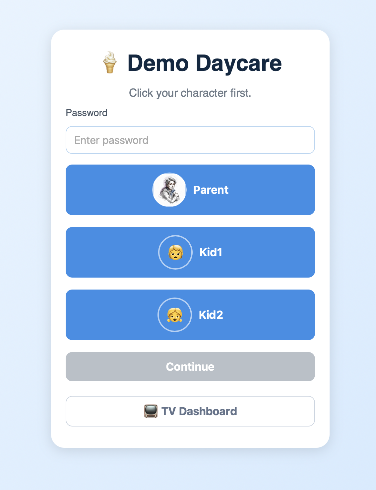
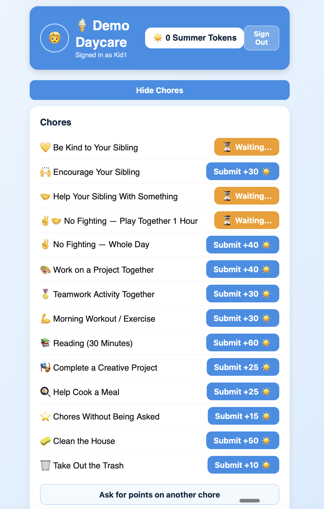
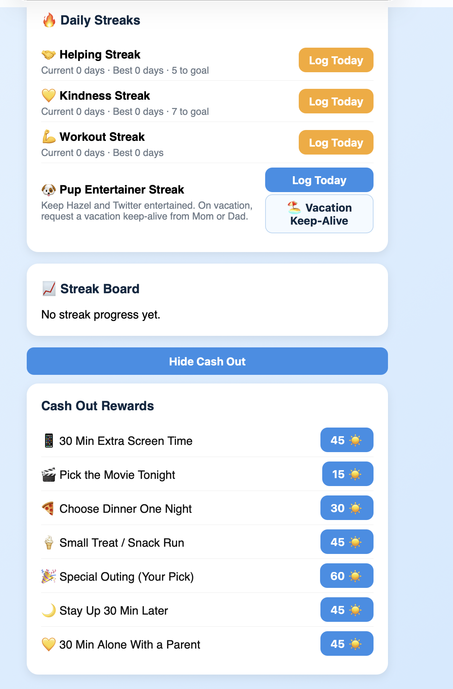
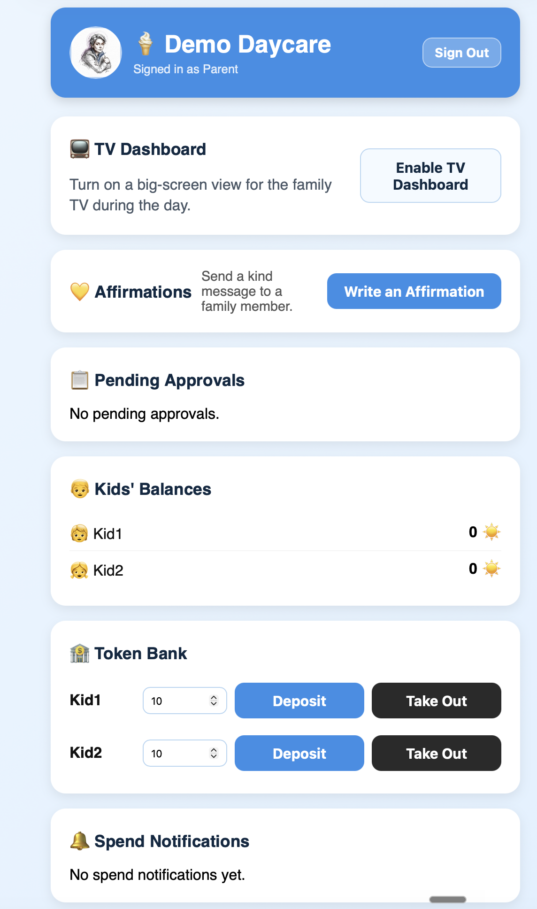
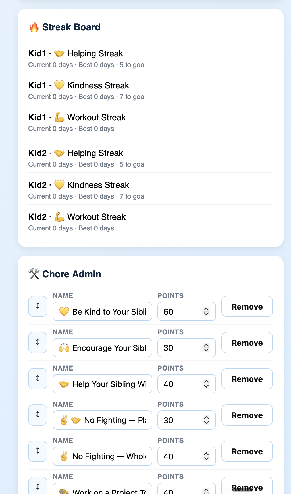
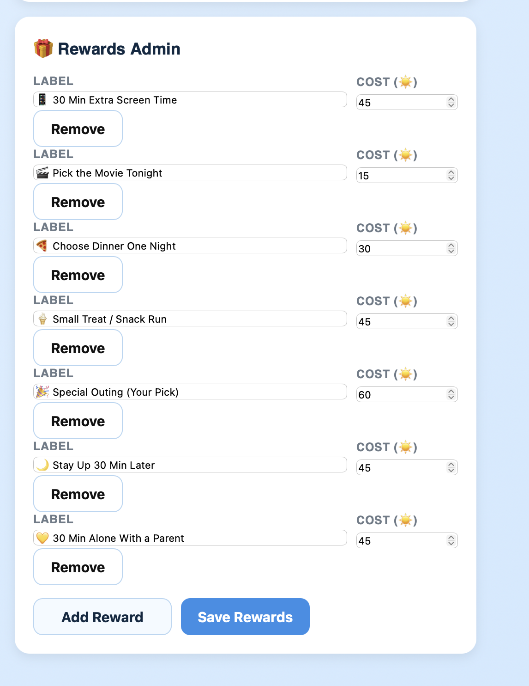
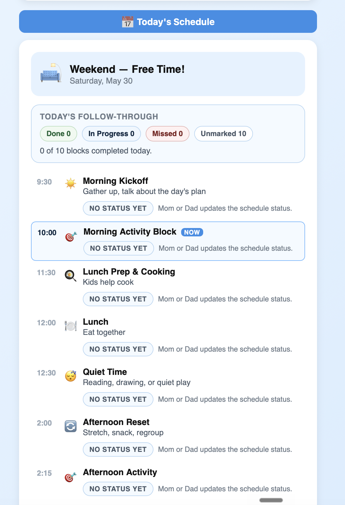
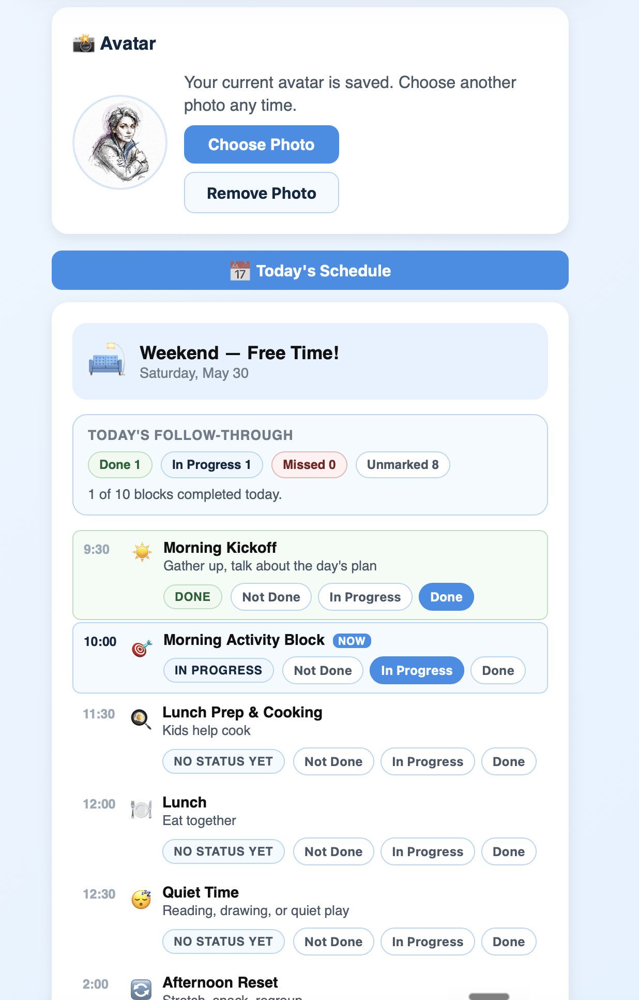
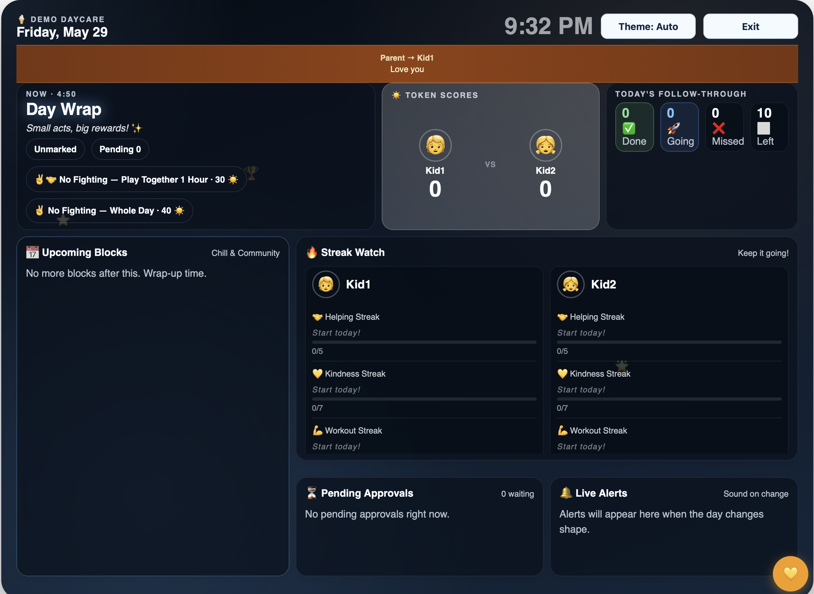

# Daddy Daycare

A token economy and gamification system for kids — built to run all summer.

Parents approve every submission. Kids earn Summer Tokens and spend them on rewards. Everything syncs across devices via Cloudflare KV — no accounts, no email, just role buttons and passwords each family member sets on first launch.

**Built by Rocky and Griffin Capobianco, summer 2026.**

→ **[Full feature reference](docs/FEATURES.md)**

---

## What it does

**For kids:**
- Submit chores and daily streaks for parent approval
- Write affirmations to earn bonus tokens
- Track streak progress (helping, kindness, workout — and any custom streaks you add)
- Spend tokens in the rewards shop
- Upload a photo avatar

**For parents:**
- Approve or deny every submission from a single queue — nothing auto-credits
- Adjust token balances manually (bonuses, consequences)
- Manage chores and rewards from an inline admin panel
- Mark daily schedule blocks as done, in-progress, or missed
- Enable **TV Dashboard** mode for the living room screen: live token scoreboard, streak watch, upcoming schedule, affirmation ticker, and real-time alerts

**Configurable for any family:**
- Parent and kid roles (names, count) via environment variables
- Chore list, reward list, and point values via the admin panel
- Custom streaks (define any habits you want to track, with optional vacation keep-alive)
- Full schedule — week labels, day themes, time blocks, date overrides

---

## Screenshots

**Login — pick your character, set your password on first launch**



---

**Kid view — submit chores, log streaks, cash out rewards**

| Chores | Streaks & Rewards |
|:------:|:-----------------:|
|  |  |

---

**Parent view — approve submissions, manage balances, configure chores and rewards**

| Dashboard | Streak & Chore Admin | Rewards Admin |
|:---------:|:--------------------:|:-------------:|
|  |  |  |

---

**Daily schedule — kids see the plan, parents mark each block done, in-progress, or missed**

| Kid view (read-only) | Parent view (with status controls) |
|:--------------------:|:----------------------------------:|
|  |  |

---

**TV Dashboard** — living room scoreboard with token totals, streak watch, upcoming schedule, and live alerts



---

## Getting Started

### Who is this for?

This app is built for parents who want a structured, tech-powered reward system for their kids — a digital allowance ledger with real-time sync, a TV dashboard, and daily schedule tracking. The content (chores, points, streaks, rewards, schedule) is 100% yours to define.

**The app itself requires no technical skills to use day-to-day.** Kids tap buttons. Parents approve. The TV dashboard runs in a browser.

**Setup is a different story.** It involves GitHub, Cloudflare, a terminal, and some JSON editing. Here's an honest breakdown:

| Task | Skill level |
|------|-------------|
| Create a GitHub account | Anyone |
| Create a Cloudflare account | Anyone |
| Fork a GitHub repo | Beginner |
| Run terminal commands | Intermediate |
| Edit a JSON config file | Intermediate |
| Connect GitHub to Cloudflare auto-deploy | Intermediate |

### The recommended path: use an AI coding agent

You don't need to know how to do any of this yourself. If you install [Claude Code](https://claude.ai/code) or [OpenCode](https://opencode.ai), you can hand the entire setup to the agent.

**What you provide:**
- Your family's names (who's a parent, who's the kids)
- Your Cloudflare login (the agent will ask you to run `wrangler login`)
- Your summer plan — what a typical day looks like, any vacations or special weeks, what your kids can earn points for

**What the agent does:**
- Forks the repo, clones it, fills in all config files
- Creates the Cloudflare KV namespaces
- Writes your schedule config
- Pushes to GitHub and connects Cloudflare auto-deploy
- Tests the app end-to-end before declaring it done

To try this: install Claude Code, open a terminal in any directory, and say:

> "Set up the Daddy Daycare app for my family. Here's our info: [your family names, summer schedule]. Follow the setup guide at [your fork URL]."

The AI agent checklist at the bottom of this README is written specifically for agents to follow.

### The manual path

If you prefer to do it yourself, follow the step-by-step setup below. Budget about an hour if you're comfortable with a terminal. The steps are explicit and each one has a clear output you can verify.

---

## Stack

- Vanilla HTML/CSS/JS — no build step, no bundler
- Cloudflare Workers (serving static assets + API)
- Cloudflare KV (persistent state, synced across devices)

---

## For Families — Setting This Up

> **Recommended:** Use [Claude Code](https://claude.ai/code) or [OpenCode](https://opencode.ai). Point it at this README and say "set this up for my family." The agent can handle the entire setup if you give it your family details and Cloudflare credentials.

### Prerequisites

- A [Cloudflare account](https://dash.cloudflare.com/sign-up) (free tier works)
- [Node.js](https://nodejs.org) 18+ and [Bun](https://bun.sh) installed
- [Wrangler CLI](https://developers.cloudflare.com/workers/wrangler/): `bunx wrangler` (no global install needed with Bun)
- A GitHub account (for auto-deploy)

### Step 1 — Fork the repo privately

Fork this repo. **Make your fork private** — it will contain your family's schedule and configuration.

### Step 2 — Clone your fork

```bash
git clone https://github.com/YOUR_USERNAME/DayCare.git
cd DayCare
bun install
```

### Step 3 — Authenticate with Cloudflare

```bash
bunx wrangler login
```

### Step 4 — Create KV namespaces

You need two separate KV namespaces — one for production, one for dev/staging:

```bash
# Production
bunx wrangler kv namespace create DAYCARE_KV

# Dev/staging
bunx wrangler kv namespace create DAYCARE_KV_DEV
```

Each command prints an `id`. Copy both — you'll need them in the next step.

### Step 5 — Configure wrangler.jsonc

Open `wrangler.jsonc` and fill in your family's details. The file has two sections: the root config (production) and the `env.dev` block (staging). Update both:

```jsonc
{
  "vars": {
    "APP_NAME": "Your App Name",
    "PARENT_ROLES": "[\"Mom\",\"Dad\"]",
    "KID_ROLES": "[\"Alice\",\"Bob\"]",
    "ALLOWED_IP": ""                     // optional: your home IP to restrict access
  },
  "kv_namespaces": [
    { "binding": "DAYCARE_KV", "id": "YOUR_PRODUCTION_KV_ID" }
  ],
  "env": {
    "dev": {
      "vars": {
        "APP_NAME": "Your App Name",
        "PARENT_ROLES": "[\"Mom\",\"Dad\"]",
        "KID_ROLES": "[\"Alice\",\"Bob\"]",
        "ALLOWED_IP": ""
      },
      "kv_namespaces": [
        { "binding": "DAYCARE_KV", "id": "YOUR_DEV_KV_ID" }
      ]
    }
  }
}
```

Role names (Mom, Dad, Alice, Bob) become the character buttons on the login screen. **Use the same names in both the production and dev blocks.**

### Step 6 — Customize your schedule

Copy the example config and customize it:

```bash
cp schedule.config.example.js schedule.config.js
```

Edit `schedule.config.js` to match your family's summer. This file configures:

- **`weekRanges`** — named weeks shown in the dashboard header (vacations, camps, milestones)
- **`dayThemes`** — what each weekday is called and what activities are suggested
- **`dailyBlocks`** — the time blocks that appear in the daily schedule panel
- **`customDates`** — override blocks for specific dates (appointments, trips, special events)
- **`transitionRange`** — a date range with different blocks (useful for a ramp-up phase)

**Commit this file to your private fork** — Cloudflare serves it as a static asset:

```bash
git add schedule.config.js
git commit -m "add family schedule config"
git push origin main
```

### Step 7 — Customize chores and rewards (optional)

Default chores and rewards are defined in `worker.js` under `DEFAULT_CHORES` and `DEFAULT_REWARDS`. Edit these to match your family's point economy, then push to `dev` to test before merging to `main`.

### Step 8 — Connect Cloudflare to GitHub

1. Go to [dash.cloudflare.com](https://dash.cloudflare.com) → Workers & Pages
2. Create a new Worker → connect to GitHub → select your fork
3. Set branch to `main`, build command blank, deploy command: `bunx wrangler deploy`
4. Repeat for a `dev` Worker pointed at your `dev` branch with deploy command: `bunx wrangler deploy --env dev`

After connecting, every push to `main` auto-deploys production. Every push to `dev` auto-deploys staging.

### Step 9 — Run tests

```bash
bun test        # all 33 must pass
```

### Step 10 — Deploy and set passwords

Push to `dev` and open your staging URL:

```bash
git push origin dev
```

**Passwords are set by each family member on first use** — there's nothing to configure in advance:

1. Open the app in a browser
2. Click your character (Mom, Dad, Alice, etc.)
3. The app will prompt you to create a password — this only happens once
4. After that, your password is stored (PBKDF2-hashed) in KV and used for all future logins

Repeat for each family member. Parents should set up their accounts before handing the app to kids.

### Step 11 — Test it

Log in as a parent, make sure approvals work. Then log in as a kid and submit a chore. When everything looks good, merge to `main`:

```bash
git checkout main
git merge dev
git push origin main
```

---

## Branch workflow

| Branch | Environment | URL | Auto-deploys on |
|--------|-------------|-----|-----------------|
| `dev` | Staging | `your-app-dev.workers.dev` | push to `dev` |
| `main` | Production | `your-app.workers.dev` | push to `main` |

**Always work on `dev` first.** Test, then merge `dev` → `main`.

Never push directly to `main` — that deploys immediately to the live app your kids use.

---

## Staying up to date

When bug fixes or new features are published to this repo, you can pull them into your private fork without touching your family config.

### One-time setup — add the upstream remote

```bash
git remote add upstream https://github.com/Rewdog/daddy-daycare.git
```

### Pulling an update

```bash
# Make sure you're on dev
git checkout dev

# Fetch latest from the public repo
git fetch upstream

# Merge it in
git merge upstream/main
```

**What might need attention after a merge:**

- **`wrangler.jsonc`** — if it has a merge conflict, keep your KV IDs and role names; accept any other changes from upstream.
- **`worker.js` / `app.js`** — pure code, no family data. Accept upstream changes.
- **`schedule.config.js`** — never touched by upstream (it's in `.gitignore`). Your schedule is safe.

After merging, run tests and deploy to dev to verify before merging to main:

```bash
bun test
git push origin dev
# verify at your staging URL, then merge to main
```

---

## For AI Agents — Setup Checklist

If you're an AI agent (Claude Code, OpenCode, Copilot) setting this up for a family, follow these steps in order. Each step has a concrete verification.

1. **Fork and clone** — `git clone` the private fork, confirm you're on the `main` branch
2. **wrangler login** — run `bunx wrangler login`, confirm `bunx wrangler whoami` returns the correct account
3. **Create KV namespaces** — run `bunx wrangler kv namespace create DAYCARE_KV` (production) and `bunx wrangler kv namespace create DAYCARE_KV_DEV` (dev), capture both IDs
4. **Fill wrangler.jsonc** — insert KV IDs and family vars (APP_NAME, PARENT_ROLES, KID_ROLES) in both the root block and the `env.dev` block
5. **Customize schedule.config.js** — ask the family for their summer plan, fill in all sections, commit the file
6. **Customize DEFAULT_CHORES / DEFAULT_REWARDS** in worker.js to match the family's point economy
7. **Run `bun test`** — all 33 must pass; fix any failures before proceeding
8. **Push to dev** — `git push origin dev`
9. **Connect Cloudflare Workers** to the GitHub fork (prod → `main` with `bunx wrangler deploy`, staging → `dev` with `bunx wrangler deploy --env dev`)
10. **Verify staging** — open the staging URL; each family member clicks their character and sets a password on first launch; confirm parent approval flow works end-to-end
11. **Merge dev → main** — only after staging verification passes

---

## Running locally

```bash
bunx wrangler dev
```

Opens at `http://localhost:8787`. Local dev uses the dev KV namespace.

---

## Tests

```bash
bun test
```

All 33 tests cover:
- Worker auth, IP restriction, CORS, endpoint gating
- `app.js` structural invariants (appState shape, localStorage guardrails, required functions)

Tests run automatically via a pre-push git hook (`git config core.hooksPath .githooks`).

---

## Contributing

PRs welcome — open an issue first for anything beyond a small fix. If you add a new `appState` field, add it to both `resetAppState()` and `refreshState()` in `app.js` or the invariant tests will fail.

Family-specific content (names, specific schedules, IP addresses) must not appear in PRs.

---

## License

MIT
